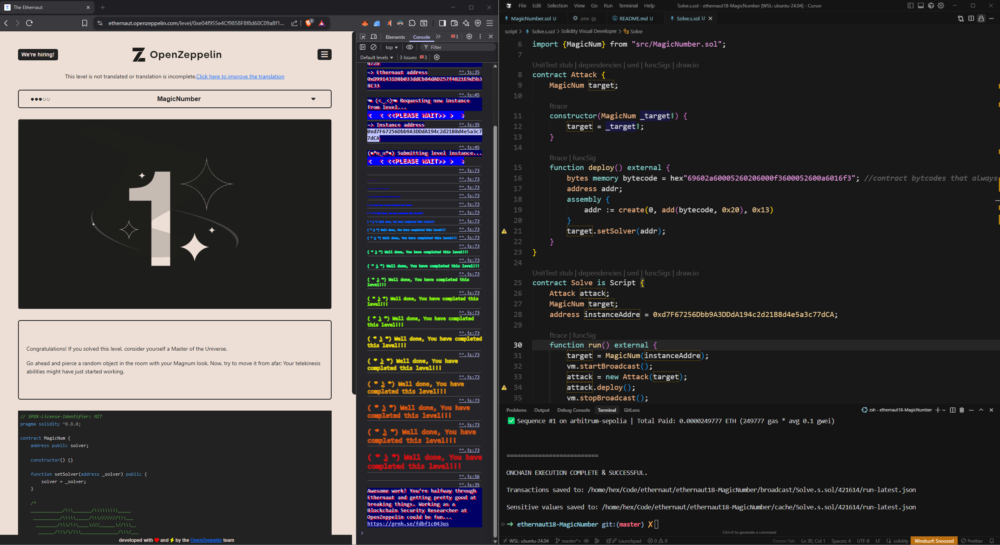

## Ethernaut Level 18 — MagicNumber (Foundry)

Solve Ethernaut’s MagicNumber by deploying a tiny "solver" contract (≤ 10 bytes runtime) that always returns 42, and registering it on the instance.

### Addresses

- **Instance address**: `0xd7F67256Dbb9A3DDdA194c2d21B8d4e5a3c77dCA`
- **Level address**: `0xe04f955e4Cf9858F8f8d60C09aBf16DF23D4672b`

### Prerequisites

- Foundry installed (`forge`, `cast`)
- An RPC URL and a funded private key for the network where your Ethernaut instance lives

Export env vars (example):

```bash
export RPC_URL="https://your-network-rpc"
export PRIVATE_KEY="0xYOUR_PRIVATE_KEY"
```

### Solve

This repo contains a script and an attack helper:

- `script/Solve.s.sol` — broadcasts a deployment of a minimal bytecode solver via `Attack.deploy()` and calls `setSolver` on the instance
- `src/MagicNumber.sol` — Ethernaut-provided interface of the level

Run the script (broadcast):

```bash
forge script script/Solve.s.sol:Solve \
  --rpc-url $RPC_URL \
  --private-key $PRIVATE_KEY \
  --broadcast -vv
```

If successful, your solver address will be set on the instance.

### Verify On-Chain

1. Read the solver set on the instance:

```bash
cast call 0xd7F67256Dbb9A3DDdA194c2d21B8d4e5a3c77dCA "solver()(address)" --rpc-url $RPC_URL
```

2. Inspect the solver’s runtime bytecode (should be very small, ≤ 10 bytes):

```bash
SOLVER=0x... # address returned above
cast code $SOLVER --rpc-url $RPC_URL
```

3. Optional: Call the (non-existent) function that Ethernaut will query. The solver returns 42 for any calldata:

```bash
cast call $SOLVER "whatIsTheMeaningOfLife()(uint256)" --rpc-url $RPC_URL
# Expect: 42
```

### How the Bytecode Works (short)

`Attack.deploy()` uses creation bytecode:

```
0x69602a60005260206000f3600052600a6016f3
```

This returns a tiny runtime that, on any call, writes `0x2a` (42) into memory and returns it as a 32-byte word. The runtime is ≤ 10 bytes, satisfying the level’s constraint.

### Submit Level

After verifying the solver and that it returns 42, submit the level in the Ethernaut UI using your instance.

### Screenshot



```
Submit level txnHash: 0x2d677b636b992a40e8afc8de5be28b15cf5a95eb311fd62c6eefe3b700c553c3
Instance address: 0xd7F67256Dbb9A3DDdA194c2d21B8d4e5a3c77dCA
Level address: 0xe04f955e4Cf9858F8f8d60C09aBf16DF23D4672b
```
