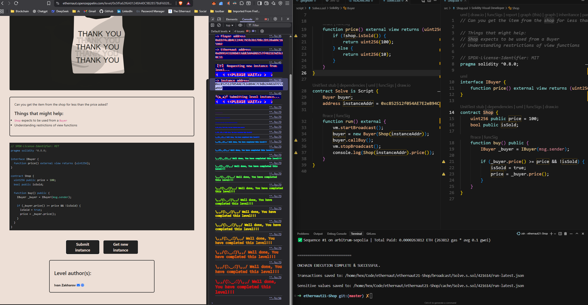

# Ethernaut Level 21: Shop

## Challenge Description

This level requires you to buy an item from the shop for less than the price asked (100 wei). The shop expects to be used from a Buyer contract and has restrictions on view functions.

## Challenge Analysis

### Shop Contract

The `Shop` contract has:

- `price`: Initially set to 100 wei
- `isSold`: Boolean flag indicating if item is sold
- `buy()`: Function that allows buying if the buyer's price is >= shop's price and item isn't sold yet

### Key Vulnerability

The vulnerability lies in the `buy()` function logic:

1. It calls `_buyer.price()` to get the buyer's offered price
2. If `_buyer.price() >= price && !isSold`, it sets `isSold = true` and updates `price = _buyer.price()`
3. **The issue**: The buyer can return different prices on subsequent calls to `price()`

## Solution Strategy

### Exploit Mechanism

1. **First call to `price()`**: Return 100 (meets the condition `>= price`)
2. **Second call to `price()`**: Return 10 (after `isSold` becomes true)

### Implementation

The `Buyer` contract implements the `IBuyer` interface:

- `price()`: Returns 100 initially, then 10 after the item is sold
- `callBuy()`: Calls the shop's `buy()` function

## Files Structure

```
├── src/
│   └── Shop.sol          # Original vulnerable contract
├── script/
│   └── Solve.s.sol       # Exploit script
└── README.md              # This file
```

## Usage

### Prerequisites

- Foundry installed
- Access to the Ethernaut instance

### Running the Exploit

```bash
# Deploy and run the exploit
forge script script/Solve.s.sol --rpc-url <RPC_URL> --private-key <PRIVATE_KEY> --broadcast
```

### Expected Result

- The shop's `price` will be updated to 10 wei (the second price returned by the buyer)
- The item will be marked as sold (`isSold = true`)
- Console output will show the final price: 10

## Key Learning Points

1. **State-dependent view functions**: View functions can return different values based on contract state
2. **Reentrancy-like patterns**: Multiple calls to the same function can yield different results
3. **Interface exploitation**: Implementing interfaces allows interaction with contracts while maintaining control over return values

## Security Implications

This vulnerability demonstrates how view functions can be exploited when they depend on mutable state. The shop contract should have validated the price consistency or used a different mechanism to prevent price manipulation.

## Contract Addresses

- **Instance**: `0xc852512f054AE7E2eB94C7C9db24402d7E53a91F`
- **Level**: `0x5fFa62f6A01248A40C9B2857BdF6028b75d71693`
- **Transaction**: `0x05b35d1da333bf9a9f35c7048724843583b463489eb9fe8528c821d03d834314`

## ScreenShot


